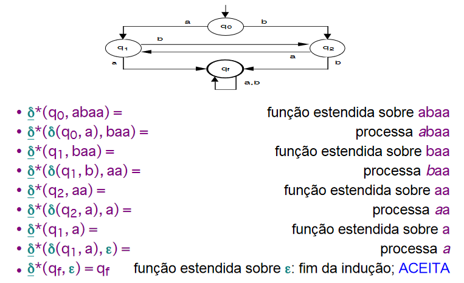
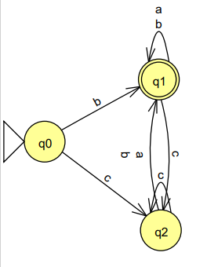
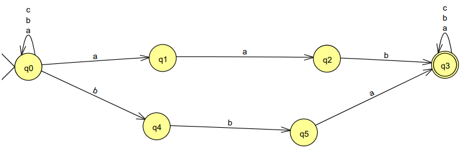
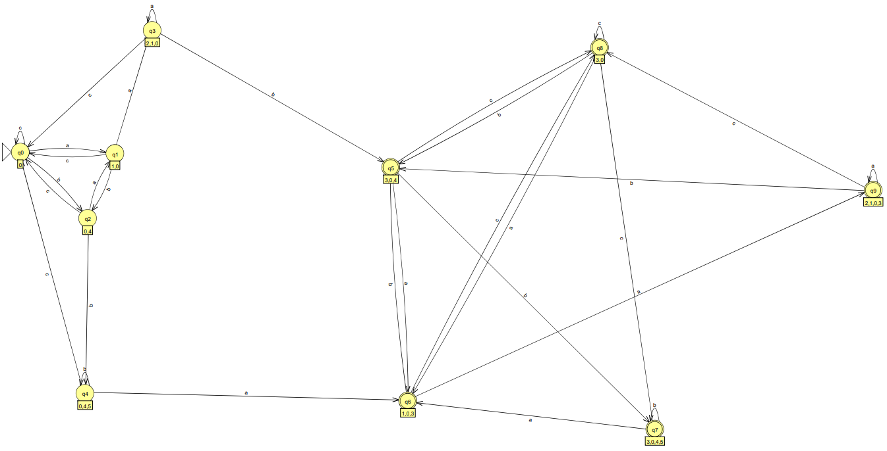

<h1 style="text-align:center">Exercício Aula 3 - Função Estendida e AFND</h1>

Bárbara Boechat 
Teoria de Linguagens   Universidade Federal de São João del-Rei 

## 1 -Como funciona a função programa estendida para um AFD? Defina e explique com exemplos.

A função estendida é de sucessiva aplicação da função programa daquele autômato, ou seja, para cada símbolo da palavra a partir de um dado estado - começa a partir do estado inicial-, se a entrada for vazia, fica parada. O processo de utilização da função estendida é útil para testar se uma palavra é ACEITA ou REJEITADA pelo automato em questão. 

## 2 -  O que significa cada elemento da quíntupla necessária para definir um autômato Não determinístico  M = (Q, Σ, δ, q0, F )?

- Q: conjunto de estados possíveis do autômato (finito)
- Σ: alfabetos de símbolos de entrada
- δ: função programa ou função de transição (função parcial)
- q0: estado inicial
- F: conjunto de estados finais

## 3 - Elabore um autômato não determinístico e transforme-o em determinístico para cada uma das seguintes linguagens?

### a) Conjunto de todas as palavras sobre o alfabeto Σ = {a,b,c} que não possuem o símbolo 'a' como prefixo e não possui o símbolo 'c' como sufixo.

### b) Conjunto de todas as palavras sobre o alfabeto Σ = {a,b,c} que possuem aab ou bba como subpalavra.

#### AFND:

#### AFND transformado em AFD:

