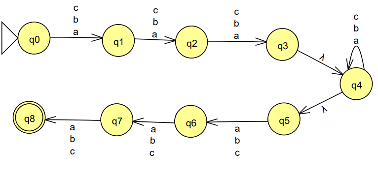
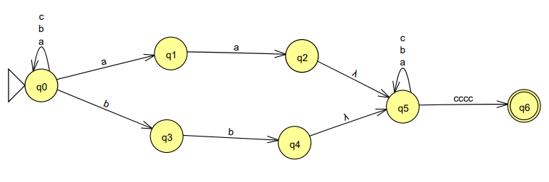
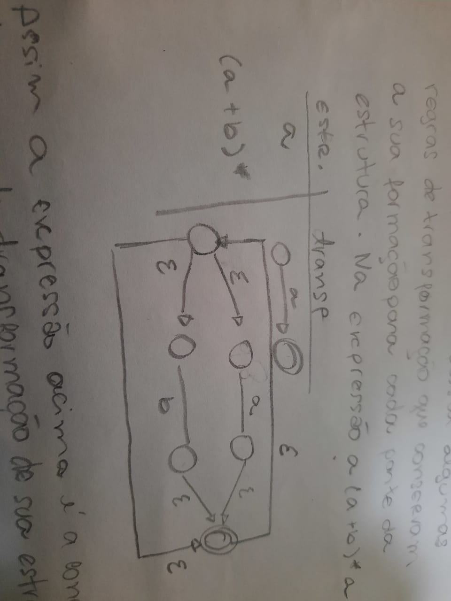

<h1 style="text-align:center">Exercício Aula 4 - AFN-e ERs</h1>

Bárbara Boechat 
Teoria de Linguagens   Universidade Federal de São João del-Rei 

## 1 - Transforme o AFN-e a seguir em um AFD,explique os passos.

## 2 - Faça um AFN-e para cada uma das linguagens que seguem Σ = {a,b,c}

### a) L= {|w1w2w3| w2 é qualquer e |w1|=3 e |w3|=3}

### b) L = {w | aa ou bb é subpalavra e cccc é sufixo}

## 3 - Faça as expressões regulares para as linguagens que seguem todas sobre Σ = {a,b}:

### a) L = {w | w possui aba como subpalavra}

    (a + b)*aba(a + b)*

### b) L = {w | tal que w não contém dois a adjacentes}

    (a + e)(b + ba)*

### c) L = {w | w possui aa e bb como subpalavras}
    
    (a + aba)*(b + bab)*

## 4 - Descreva como funciona a transformação de uma ER para um AFN-e e aplique na seguinte expressão: a(a + b)*a

Uma era para AFN-e possui algumas regras de transformação que conversam a sua formação para cada parte da estrutura. Na expressão a(a + b)* a por exemplo 

Assim a expressão acima é a concatenação das regras de transformação de sua estrutura. 

